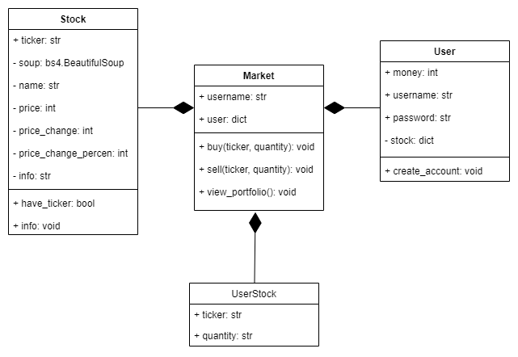

# **Stock-market-simulator**

This program is a part of the 01219114-65 Programming 1 course at Kasetsart University

## Overview

This program is a stock market simulator that allows you to buy and sell stocks. 
It also allows you to view your portfolio and the current stock price.
Inspired by me has interest in stock market and want to learn more about it. 

## Features

- Buy and sell stocks with real-time stock price
- View your portfolio
- View the current stock price
- view the stock information
- Recommend Top 30 stocks trending


## The program's requirement
This program is written in Python 3.10.8.
To run this program, you need to install the following libraries:
* [`json`](https://docs.python.org/3/library/json.html?highlight=json#module-json), used for save data
* [`requests`](https://docs.python.org/3/library/urllib.request.html?highlight=requests#module-urllib.request), used for get data from API
* [`BeautifulSoup`](https://www.crummy.com/software/BeautifulSoup/bs4/doc/), used for web scraping from yahoo finance
* `python` version 3.7 at least

## How to run the program
1. Clone this repository
```commandline
git clone https://github.com/Peanutt47/Stock-market-simulator.git
```
2. Install the required libraries
```commandline
pip install -r requirements.txt
```
3. Run the program
```commandline
python main.py
```

## How to use the program
1. Create an account
2. Login
3. If you want to buy stock, choose 1 and enter the stock symbol and the amount of stock you want to buy
4. If you want to sell stock, choose 2 and enter the stock symbol and the amount of stock you want to sell
5. If you want to view the top 30 trending stocks, choose 3
6. If you want to view your portfolio, choose 4
7. If you want to view the stock information, choose 5 and enter the stock symbol
8. If you want to logout, choose 6


## Program Design
There are 4 main classes in this program:
* `User` class, used to store the user's information
* `Stock` class, used to store the stock's information
* `Market` class, used to Buy and sell stocks and view portfolio
* `UserStock` class, used to store the user's stock information

**This is UML diagram of the program.**


## Program's Structure
The program is divided into 5 main parts:
* [`main.py`](main.py), the main program has the main menu and the login menu and communicate with the other classes.
* [`user.py`](user.py), the user class that store the user's information and create the user's data in [`user_data.json`](user_data.json).
* [`stock.py`](stock.py), the stock class that store the stock's information and check the stock's symbol.
* [`market.py`](market.py), the market class that allow the user to buy and sell stocks and view the portfolio.
* [`stock_user.py`](stock_user.py), the user stock class that store the user's stock information